## 1. Planteamiento general de la práctica

La práctica tiene dos actividades relacionadas con el entrenamiento de políticas para el robot humanoide Unitree G1:

- **Actividad 1:** entrenar una política de marcha para el G1 usando LeggedGym.
- **Actividad 2:** entrenar una política de cuerpo completo para que el G1 porte una bandeja, usando BeyondMimic.

La idea principal que tuve que aclarar al principio fue la diferencia entre **crear una política** y **entrenar una política**:

```text
crear una política = definir red, observaciones, acciones, rewards y tarea
entrenar una política = optimizar los pesos de esa red con PPO en simulación
```

En la Actividad 1, la política de marcha no se diseña desde cero. La tarea `g1` ya está definida en el framework. Lo que se debe hacer es preparar el entorno, instalar las dependencias y entrenar los pesos de la red.

## 2. Repositorio y herramientas usadas

Se ha realizado un fork del repo [RL](https://github.com/JeanMayoko18/RL) de **Jean Mayoko** (investigador parte del grupo de robótica de la universidad). Este repositorio contiene el código necesario para entrenamiento de robots con Isaac Gym, LeggedGym y BeyondMimic.

El repositorio contiene dos pipelines principales:

- `LeggGym/`: entrenamiento de locomoción con RL usando Isaac Gym y LeggedGym.
- `BeyondMimic/`: entrenamiento de cuerpo completo mediante motion tracking usando Isaac Lab / BeyondMimic.

Para la **Actividad 1** se usó principalmente:

```text
LeggGym/
  isaacgym/ (kit de desarrollo de Isaac Gym)
  rsl_rl/ (kit de desarrollo de rsl_rl, la librería de PPO)
  unitree_rl_gym/ (kit de desarrollo específico para robots Unitree, con tareas, rewards y scripts)
```

Dentro de `unitree_rl_gym` están los ficheros importantes de la tarea G1:

```text
legged_gym/envs/g1/g1_config.py - configuración de la tarea G1
legged_gym/envs/g1/g1_env.py - definición de la clase de entorno G1

legged_gym/scripts/train.py - script para entrenar la política en Isaac Gym
legged_gym/scripts/play.py - script para exportar la política entrenada y probarla en MuJoCo
```

La tarea `g1` aparece registrada en `legged_gym/envs/__init__.py`, y su configuración está en `g1_config.py`. Ahí se definen, entre otras cosas:

- número de observaciones: `47`
- número de acciones: `12`
- asset del robot: `g1_12dof.urdf`
- rewards de marcha
- política recurrente: `ActorCriticRecurrent`
- algoritmo de entrenamiento: PPO mediante `rsl_rl`

## 3. Actividad 1: instalación del entorno

Se trabaja **sin contenedor**, directamente en **Ubuntu 24.04**.

### 3.1 Instalación de Conda

Primero instalé Miniconda. Usé Miniconda porque necesitaba un entorno limpio con una versión concreta de Python, y porque Isaac Gym, PyTorch y CUDA suelen ser sensibles a las versiones.

Instalé Miniconda con:

```bash
mkdir -p ~/miniconda3
wget https://repo.anaconda.com/miniconda/Miniconda3-latest-Linux-x86_64.sh -O ~/miniconda3/miniconda.sh
bash ~/miniconda3/miniconda.sh -b -u -p ~/miniconda3
rm ~/miniconda3/miniconda.sh
~/miniconda3/bin/conda init bash
source ~/.bashrc
```

Se verifica con:

```bash
conda --version
```

### 3.2 Creación del entorno `unitree-rl`

La documentación recomienda Python 3.8 para este stack, así que creé un entorno específico:

```bash
conda create -n unitree-rl python=3.8
conda activate unitree-rl
python --version
```

### 3.3 Instalación de PyTorch con CUDA

Instalé PyTorch con soporte CUDA 12.1:

```bash
conda install pytorch==2.3.1 torchvision==0.18.1 torchaudio==2.3.1 pytorch-cuda=12.1 -c pytorch -c nvidia
```

Esta instalación es grande, aproximadamente 3 GB. Tarda bastante porque descarga paquetes como `pytorch`, `libcublas`, `torchtriton`, `mkl`, etc.

También probé `mamba`, que es una alternativa más rápida a `conda` para resolver e instalar paquetes. Se instala en el entorno base:

```bash
conda install -n base -c conda-forge mamba
```

Y luego se puede usar para instalar en el entorno `unitree-rl`:

```bash
mamba install -n unitree-rl pytorch==2.3.1 torchvision==0.18.1 torchaudio==2.3.1 pytorch-cuda=12.1 -c pytorch -c nvidia
```

### 3.4 Instalación de Isaac Gym

Isaac Gym no se instala como un programa normal con interfaz propia. Para LeggedGym se usa como librería Python, por eso se instala desde la carpeta `isaacgym/python`.

Desde el entorno `unitree-rl`:

```bash
cd ~/Escritorio/rl/p2-g1_rl_jazzy/LeggGym/isaacgym/python
pip install -e .
```

La opción `-e` instala en modo editable, es decir, Python usa directamente esa carpeta del repositorio.

Después hice la prueba básica de Isaac Gym:

```bash
cd ~/Escritorio/rl/p2-g1_rl_jazzy/LeggGym/isaacgym/python/examples
python 1080_balls_of_solitude.py
```

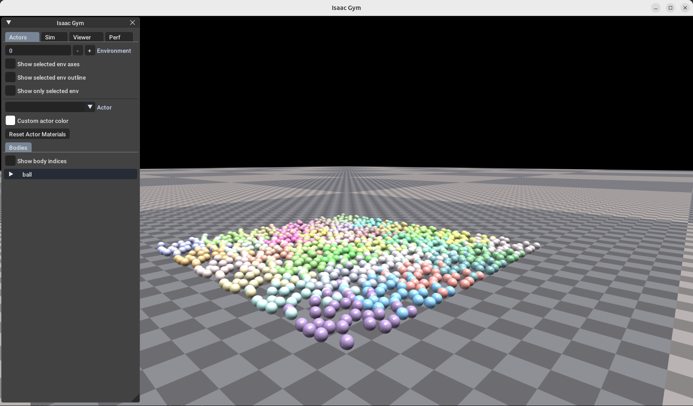

Todo parece funcionar correctamente, por lo que se continúa.

### 3.5 Instalación de `rsl_rl`

`rsl_rl` es la librería que implementa el algoritmo de aprendizaje por refuerzo. En este caso se usa PPO.

La red de este G1 es una política actor-crítico recurrente:

```text
ActorCriticRecurrent
```

En la documentación de Unitree se recomienda `rsl_rl` v1.0.2. Esto fue importante porque el subdirectorio `LeggGym/rsl_rl` estaba en una rama más moderna, pero el código de `unitree_rl_gym` usa la API antigua de `rsl_rl`.

Por eso cambié a la versión compatible:

```bash
cd ~/Escritorio/rl/p2-g1_rl_jazzy/LeggGym/rsl_rl
git switch v1.0.2
pip install -e .
```

### 3.6 Instalación de `unitree_rl_gym`

`unitree_rl_gym` contiene las tareas, robots, rewards y scripts específicos para robots Unitree.

Lo instalé con:

```bash
cd ~/Escritorio/rl/p2-g1_rl_jazzy/LeggGym/unitree_rl_gym
pip install -e .
```

Este paquete declara dependencias como:

- `isaacgym`
- `rsl-rl`
- `matplotlib`
- `numpy`
- `tensorboard`
- `mujoco==3.2.3`
- `pyyaml`

MuJoCo no es necesario para entrenar la política en Isaac Gym, pero sí es útil después para Sim2Sim, es decir, para probar la política entrenada en otro simulador.

## 4. Actividad 1: lanzamiento del entrenamiento

### 4.1 Primer entrenamiento con ventana

Antes de entrenar en serio quise ver el entorno. Para eso lancé el entrenamiento sin `--headless`. Si no se pone `--headless`, Isaac Gym abre el viewer. 

Este modo iba lento por defecto, lo cual es normal porque entrenar y renderizar a la vez consume mucho. Para simplemente comprobar que el robot y el entorno cargan, es suficiente con pocos entornos:

```bash
cd ~/Escritorio/rl/p2-g1_rl_jazzy/LeggGym/unitree_rl_gym

python legged_gym/scripts/train.py \
  --task=g1 \
  --num_envs=8 \
  --max_iterations=20 \
  --run_name=g1_visual_8envs
```

Sin embargo, esta simulación se rompió a los pocos segundos. Tras investigar el motivo, he encontrado que no conviene bajar demasiado `num_envs` porque esta política es recurrente (`ActorCriticRecurrent`, con LSTM), y con muy pocos entornos puede haber problemas en los mini-batches recurrentes de `rsl_rl`.

Por ello subí un poco y probé lo siguiente:

```bash
python legged_gym/scripts/train.py \
  --task=g1 \
  --num_envs=16 \
  --max_iterations=20 \
  --run_name=g1_visual_16envs
```

En los logs apareció algo importante:

```text
+++ Using GPU PhysX
Physics Device: cuda:0
GPU Pipeline: enabled
```

Eso confirmaba que Isaac Gym estaba usando GPU.

También aparecieron las redes:

```text
Actor RNN: LSTM(47, 64)
Critic RNN: LSTM(50, 64)
```

Esto significa que la política usa 47 observaciones para el actor y 50 para el crítico.

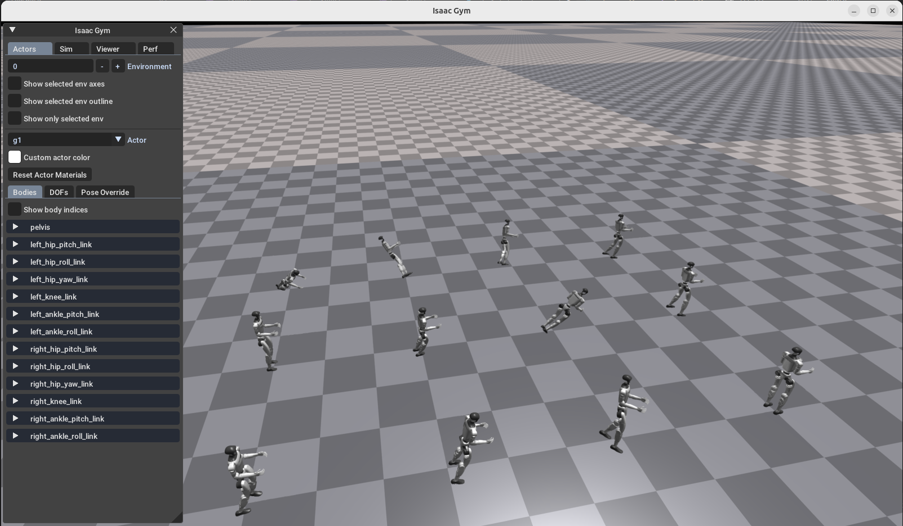

Como se ve en la imagen 20 robots empezaban el entrenamiento cayendo, continuamente. Suficiente para mí y para comprobar que todo funciona.

### 4.2 Entrenamiento headless

Después de comprobar visualmente que el entorno arrancaba, se lanzó el entrenamiento sin ventana, que es lo adecuado para entrenar de verdad.

Usé:

```bash
python legged_gym/scripts/train.py \
  --task=g1 \
  --headless \
  --num_envs=512 \
  --max_iterations=1000 \
  --run_name=g1_headless_512
```

A pesar de la cantidad mayor de envs el equipo respondió sin problemas.

Los checkpoints se guardan en:

```text
LeggGym/unitree_rl_gym/logs/g1/<fecha>_<run_name>/
```

Dentro aparecen archivos como:

```text
events.out.tfevents...
model_0.pt
model_50.pt
```

Según la iteración del entrenamiento.

### 4.3 TensorBoard

Para ver el progreso usé TensorBoard:

```bash
cd LeggGym/unitree_rl_gym
tensorboard --logdir=logs/g1 --port=6006
```

Luego abrí en el navegador:

```text
http://localhost:6006
```

Al principio tuve un problema con TensorBoard:

```text
TypeError: MessageToJson() got an unexpected keyword argument 'including_default_value_fields'
```

El problema era una incompatibilidad entre `tensorboard==2.14.0` y `protobuf==5.29.6`. La solución fue bajar la versión de `protobuf`:

```bash
pip install protobuf==3.20.3
```

Después de eso TensorBoard funcionó correctamente.

## 5. Actividad 1: Resultados

### 5.1 Gráficas importantes

Las gráficas que me interesan para saber si el entrenamiento va bien son:

Interpretación:

- `Train/mean_reward`: debería subir con el tiempo.
- `Train/mean_episode_length`: debería subir o mantenerse alto, indica que el robot dura más sin caer.
- `Episode/tracking_lin_vel`: indica si sigue la velocidad lineal comandada.
- `Episode/tracking_ang_vel`: indica si sigue la velocidad angular.
- `Episode/orientation`: penaliza inclinaciones y tambaleo; interesa que esté cerca de 0.
- `Episode/base_height`: penaliza separarse de la altura objetivo; interesa que esté cerca de 0.
- `Policy/mean_noise_std`: mide exploración; normalmente baja poco a poco.
- `Perf/total_fps`: mide la velocidad de simulación/entrenamiento.

Los rewards positivos deberían mejorar o mantenerse altos. Las penalizaciones suelen ser negativas, y lo ideal es que estén cerca de 0.

### 5.2 Rewards de la marcha

La tarea de marcha de LeggedGym no sigue una moción frame a frame. En su lugar, aprende a caminar siguiendo comandos de velocidad.

En `g1_config.py` aparecen rewards como:

```python
tracking_lin_vel = 1.0
tracking_ang_vel = 0.5
lin_vel_z = -2.0
ang_vel_xy = -0.05
orientation = -1.0
base_height = -10.0
dof_acc = -2.5e-7
dof_vel = -1e-3
action_rate = -0.01
dof_pos_limits = -5.0
alive = 0.15
hip_pos = -1.0
contact_no_vel = -0.2
feet_swing_height = -20.0
contact = 0.18
```

La interpretación general es:

- premiar que el robot siga la velocidad lineal y angular deseada
- penalizar que salte o rebote verticalmente
- penalizar que se incline demasiado
- mantener una altura razonable de la base
- evitar movimientos articulares bruscos
- evitar acercarse a límites articulares
- premiar que no se caiga
- favorecer un patrón de contacto razonable en los pies

En resumen, LeggedGym aprende una marcha estable sin tener una animación exacta de referencia.

### 5.3 Discusión y prueba de la política entrenada:

#### Gráficas de Train

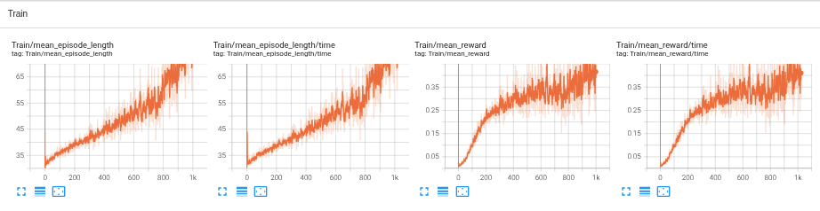

Siguiendo la prioridad mencionada en [5.1](#51-gráficas-importantes), se observa que:

- La duración del entrenamiento crece linealmente (el robot se mantiene cada vez más tiempo en pie).
- La recompensa media mejora con el tiempo pero el progreso va decreciendo.
  
Algo en común es que el ruido o inestabilidad de los resultados se amplia con el tiempo.

#### Gráficas de Episode

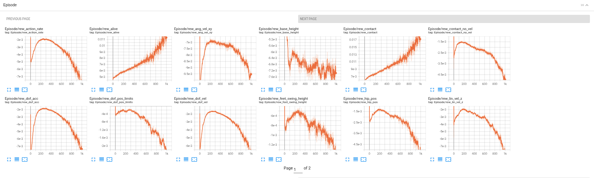

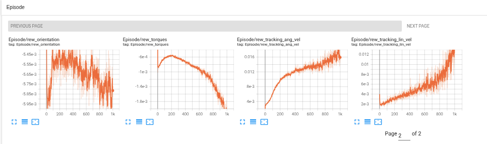

Aquí se comprobó algo curioso y es que muchas de las puntuaciones decrecieron a partir de las 200 iteraciones. En los gráficos se observa que algunas recompensas relacionadas con el seguimiento de velocidad, como `tracking_lin_vel` y `tracking_ang_vel`, siguen aumentando, pero muchas penalizaciones de estabilidad y calidad del movimiento empeoran, como `lin_vel_z`, `ang_vel_xy`, `dof_vel`, `dof_acc`, `action_rate` o `feet_swing_height`. Esto sugiere que el robot aprende a mantenerse de pie y responder parcialmente a los comandos, pero lo hace mediante movimientos poco naturales, con balanceos y contactos ineficientes, sin llegar a desarrollar una marcha estable ni avanzar de forma clara. 

#### Gráficas de policy y performance

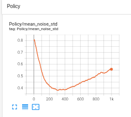
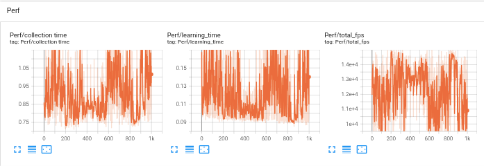

Como vimos antes la tónica general es que el ruido de la política va aumentando con el tiempo, esto representa un indicio de exploración ante el estancamiento percibido. No hay comentarios respecto al rendimiento, parece todo correcto.

#### Test en Mujoco

Usando la tool play.py se exporta la política deseada:

```bash
python legged_gym/scripts/play.py \
--task=g1 \
--num_envs=1 \
--load_run=May05_00-21-41_g1_headless_512 \
--checkpoint=1000 \
```
Esto genera un fichero exportado en:

```text
logs/g1/exported/policies/policy_lstm_1.pt
```

Esto lo deja preparado para Mujoco, que podemos lanzar con:

```bash
python deploy/deploy_mujoco/deploy_mujoco.py g1.yaml
```

Véase que el path de la politica debe quedar definido en g1.yaml que es el archivo de configuración de la prueba. Este archivo contiene otros ajustes importantes como el número de acciones, observaciones, escala de acciones (que debe corresponder con lo entrenado) y la velocidad aplicada al robot (0.5).

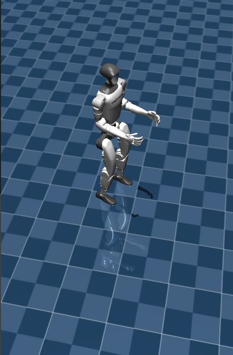
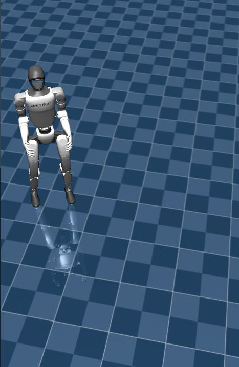
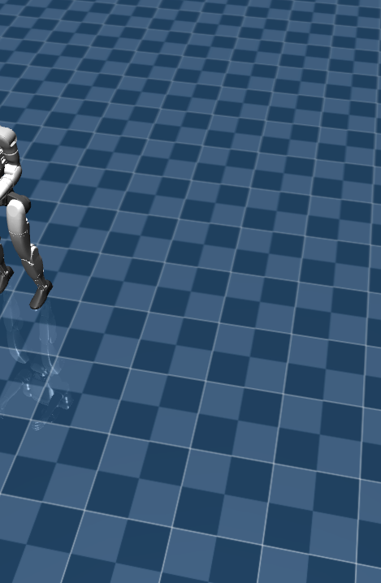

Se puede comprobar lo esperado, el robot se desplaza de forma estraña de forma lateral (sin avanzar mucho hacia delante), lo que parece casi más una consecuencia de mantenerse en equilibrio al intentar avanzar (lo cual al menos consigue).

Probé también la iteración 200 donde muchas recompensas empezaban a bajar pero realmente lo que me encontré fue un robot que ganaba recompensa de avance por caer hacia delante, lo que tampoco sirvió de mucho. La disminución de algunas recompensas y la subida de otras se debe a la propia mejora de estabilidad del modelo

Tampoco ayudo subir algo la velocidad lineal, el robot no conseguía dar su primer paso.

## 6. Actividad 1: Rediseño del entrenamiento.

Para dar más relevancia a la recompensa de avance de marcha, se modificaron algunos pesos de las recompensas:

```py
        class scales( LeggedRobotCfg.rewards.scales ):
            tracking_lin_vel = 2.0  # antes 1.0
            tracking_ang_vel = 0.5
            lin_vel_z = -2.0
            ang_vel_xy = -0.05
            orientation = -1.0
            base_height = -10.0
            dof_acc = -2.5e-7
            dof_vel = -1e-3
            feet_air_time = 0.0
            collision = 0.0
            action_rate = -0.01
            dof_pos_limits = -5.0
            alive = 0.05 # antes 0.5
            hip_pos = -1.0
            contact_no_vel = -0.2
            feet_swing_height = -20.0
            contact = 0.10 # antes 0.18
```

De esta forma se favorece más el avance, y se penaliza menos la inestabilidad. Esto es un rediseño de la tarea, que puede ayudar a que el robot aprenda a caminar de forma más estable y con mejor recompensa de avance.

Podemos reutilizar ya nuestra política anterior, que ha aprendido bastante bien a mantenerse en pie, y continuar el entrenamiento con esta nueva configuración de recompensas para mejorar desplazamiento.

```bash
cd LeggGym/unitree_rl_gym
python legged_gym/scripts/train.py \
  --task g1 \
  --resume \
  --headless \
  --num_envs 256 \ # le tuve que bajar un poco por ram esta vez
  --load_run May05 _00-21-41_g1_headless_512 \
  --checkpoint -1 \
  --run_name fase2 \
  --max_iterations 3000
```

Lo paré a la mitad porque no me estaba convenciendo mucho desde tensorboard:

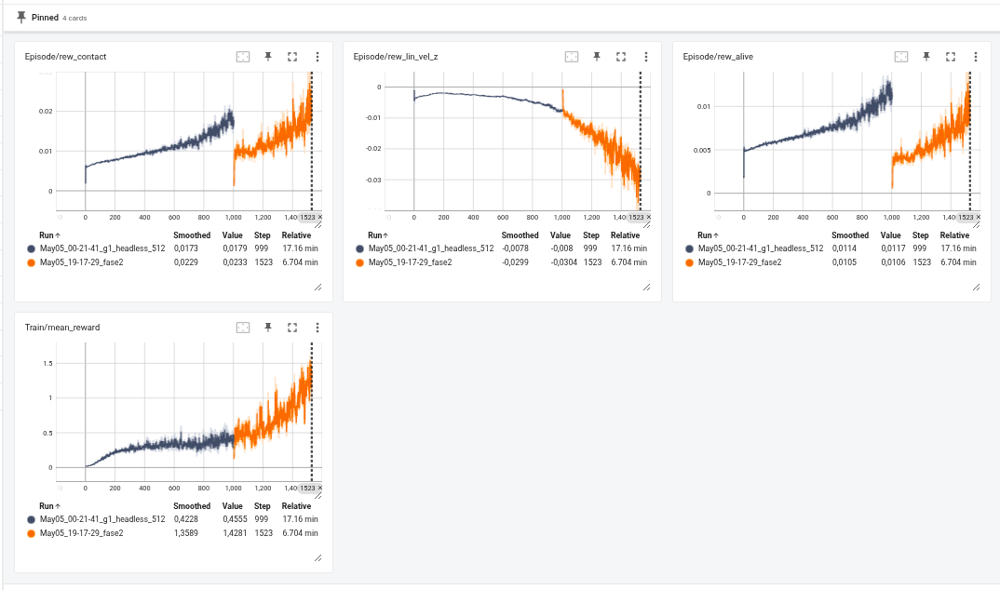

Aunque al probar en Mujoco se ve algo mejor, el robot consigue avanzar un poco más, aunque de forma extraña, a saltitos y sin una marcha clara. Parece que el rediseño de recompensas ha ayudado a mejorar el avance, pero el robot sigue sin desarrollar una marcha estable ni natural, vamos a modificar algo los comandos para que se fuerze más el avance y a repetir esta fase 2:

En `g1_config.py`, se inserta este bloque para sobreescribir la configuración general de entrenamiento:

```
class commands(LeggedRobotCfg.commands):
    heading_command = False

    class ranges(LeggedRobotCfg.commands.ranges):
        lin_vel_x = [0.2, 0.8]
        lin_vel_y = [-0.2, 0.2]
        ang_vel_yaw = [-0.3, 0.3]
```

Este bloque limita y simplifica los comandos que recibe el robot durante el entrenamiento: desactiva el seguimiento de una orientación objetivo (`heading_command = False`) y, en su lugar, le da directamente velocidades deseadas. Se fuerza principalmente el avance hacia delante con `lin_vel_x = [0.2, 0.8]`, se permite poco movimiento lateral con `lin_vel_y = [-0.2, 0.2]` y solo giros suaves con `ang_vel_yaw = [-0.3, 0.3]`. Así la tarea inicial es más fácil y el robot tiene más probabilidad de aprender a desplazarse antes de enfrentarse a comandos más complejos.

> [!WARNING]
> Vale, confusión mía, pero estaba leyendo `rew_lin_vel_z` (la velocidad de caida del tronco básicamente) como si fuera la recompensa de velocidad de avance, cuando realmente es `rew_tracking_lin_vel`. Por eso la gráfica no me tenía "buena pinta" (veía la gráfica no recuperarse), pero la simulación mejoraba.

Aclarad ahora la confusión, relanzamos el entrenamiento con una estrategia que vemos que es efectiva y mucho más agresiva que las anteriores. Más ruído, una pendiente creciente mayor en la media de las recompensas, la recompensa por velocidad de avance sube considerablemente mientras se sigue manteniendo un buen nivel de contacto. Es posible que haya que corregir el cambio de pie en una tercera fase y que el robot se esté arrastrando, pero de momento los resultados son positivos.

Lo detuve en 2500 iteraciones porque empezaba a estancarse:

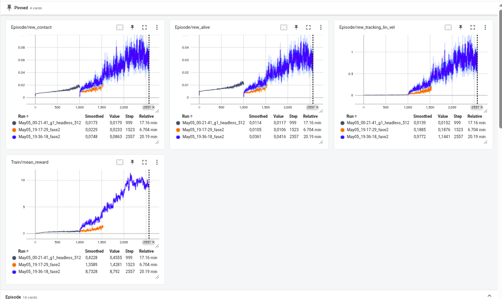

Veamos ahora el test en Mujoco:

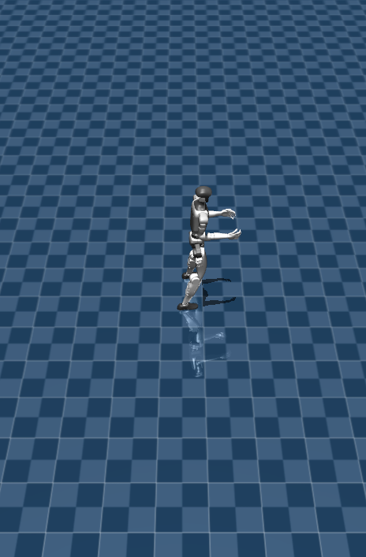
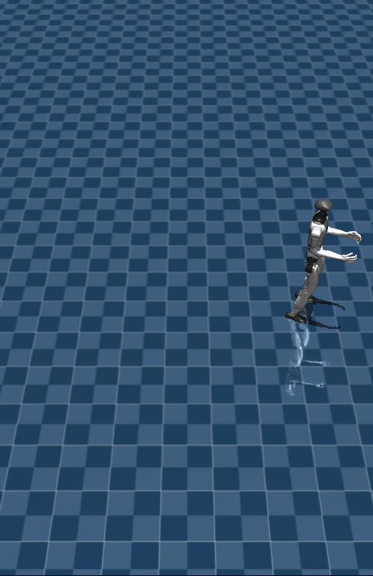

Camina! De forma descoordinada y poco lineal, pero camina. Incluso he conseguido duplicar la velocidad en MuJoCo y avanza bastante rápido sin caerse. Esto ya me agrada bastante. En una tercera fase, podemos subir un poco el número de entornos para ganar más estabilidad en las rewards, y corregir el cambio de pie, que es algo que se ve claramente en la simulación: el robot se arrastra bastante y no levanta bien las piernas. Para eso se pueden modificar los rewards relacionados con el contacto, el balanceo y la altura del pie, favoreciendo un patrón de marcha más natural.

En `g1_config.py` se puede ajustar el rango de comandos para controlar mejor la dificultad del movimiento. Por ejemplo, este bloque limita el giro y el movimiento lateral para centrar el aprendizaje en una marcha frontal más estable:

```python
class commands(LeggedRobotCfg.commands):
    heading_command = False

    class ranges(LeggedRobotCfg.commands.ranges):
        lin_vel_x = [0.3, 0.9]
        lin_vel_y = [-0.1, 0.1]
        ang_vel_yaw = [-0.15, 0.15]
```

En vez de seguir empujando tanto la velocidad lineal, bajamos ligeramente `tracking_lin_vel`, aumentamos la variabilidad de comandos y atacamos directamente el problema del arrastre de pies. La idea es que el robot no solo avance rápido, sino que aprenda una marcha más natural, con mejor alternancia de apoyos y menos contacto del pie durante la fase de swing.

En `g1_config.py`, una propuesta más equilibrada sería:

```python
class commands(LeggedRobotCfg.commands):
    heading_command = False

    class ranges(LeggedRobotCfg.commands.ranges):
        lin_vel_x = [0.1, 1.0]
        lin_vel_y = [-0.35, 0.35]
        ang_vel_yaw = [-0.5, 0.5]
```

Esto aumenta la variabilidad respecto a la fase anterior, sin meter todavía marcha atrás. El robot sigue teniendo que avanzar principalmente hacia delante, pero ahora debe adaptarse a más velocidades, algo más de lateral y giros más amplios.

Para las rewards, bajaría el peso de avance puro y suavizaría un poco las recompensas de contacto/swing para evitar que la política se vuelva demasiado rígida o saltarina:

```python
class rewards(LeggedRobotCfg.rewards):
    soft_dof_pos_limit = 0.9
    base_height_target = 0.78

    class scales(LeggedRobotCfg.rewards.scales):
        tracking_lin_vel = 1.5
        tracking_ang_vel = 0.4
        lin_vel_z = -3.0
        ang_vel_xy = -0.08
        orientation = -1.0
        base_height = -10.0
        dof_acc = -5e-7
        dof_vel = -1e-3
        feet_air_time = 0.03
        collision = 0.0
        action_rate = -0.025
        dof_pos_limits = -5.0
        alive = 0.05
        hip_pos = -1.0
        contact_no_vel = -0.2
        feet_swing_height = -25.0
        contact = 0.15
        swing_contact = -0.15
```

El cambio nuevo importante es `swing_contact`: una penalización específica para cuando el pie toca el suelo durante la fase en la que debería estar en el aire. Para eso hay que añadir en `g1_env.py`:

```python
def _reward_swing_contact(self):
    contact = self.contact_forces[:, self.feet_indices, 2] > 1.
    is_swing = self.leg_phase >= 0.55
    return torch.sum(contact & is_swing, dim=1)
```

También mantendría la altura objetivo de swing alrededor de `0.10 m`, sin subirla más de momento:

```python
pos_error = torch.square(self.feet_pos[:, :, 2] - 0.10) * ~contact
```

Así se busca levantar algo más los pies, pero sin forzar una marcha a saltos.

Continuaríamos desde el checkpoint bueno de fase 2, no desde la última fase que no convenció:

```bash
python legged_gym/scripts/train.py \
  --task g1 \
  --resume \
  --headless \
  --num_envs 368 \
  --load_run May05_19-36-18_fase2 \
  --checkpoint 2550 \
  --run_name fase3 \
  --max_iterations 3000
```

Aunque el archivo se llame `model_2550.pt`, dentro del checkpoint se guardó el contador interno como `1000`; parece que este repo no actualiza bien `current_learning_iteration` en cada checkpoint intermedio. Los logs confirman que los pesos cargados son los correctos, así que simplemente hará que la gráfica empiece desde `1000` iteraciones en lugar de `2550`, pero no debería afectar al entrenamiento.

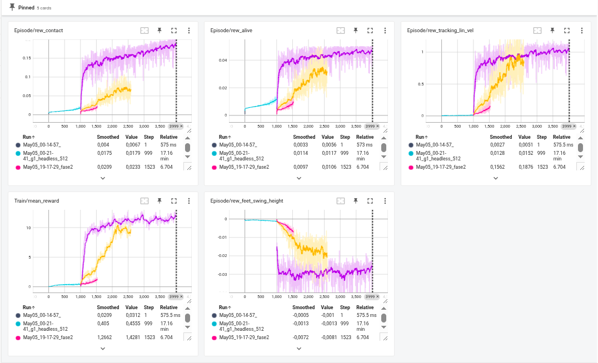

## 7. Actividad 1: Depurando la marcha con curriculum progresivo

Tras varias fases de entrenamiento, la política ya consiguió una marcha funcional en plano. La mejor base hasta este punto fue la run `May05_21-20-39_fase3`: el robot caminaba, aunque todavía de forma algo descoordinada y no siempre lineal. La fase siguiente intentó mejorar esa coordinación añadiendo terreno irregular y nuevas recompensas, pero el entrenamiento se estancó: el robot avanzaba peor, coordinaba menos las piernas y en algunos casos tendía a cruzarlas.

Analizando el entorno completo, el problema no parece ser una única reward, sino la combinación de varios cambios difíciles al mismo tiempo:

- Se añadió terreno complejo demasiado pronto.
- Se redujo demasiado `alive`, por lo que la política no recibía suficiente incentivo por mantenerse estable.
- Los comandos permitían bastante movimiento lateral y giro, justo cuando todavía interesaba reforzar marcha frontal.
- La penalización de contacto durante swing ayudaba contra el arrastre, pero también podía dificultar que una política aún débil encontrara un patrón de paso.
- La política mantiene 47 observaciones y no observa alturas del terreno; añadir percepción de terreno rompería la compatibilidad con el checkpoint anterior, así que no conviene hacerlo si queremos continuar desde fase 3.

Por eso la solución óptima no es meter más complejidad de golpe, sino hacer una **fase 4 corregida**: partir del checkpoint bueno de fase 3, reforzar avance y supervivencia, penalizar explícitamente pies demasiado cercanos y activar el terreno mediante un curriculum progresivo.

### 7.1 Mantener compatibilidad con el modelo p+revio

Es importante no cambiar la arquitectura ni el tamaño de observaciones/acciones. El checkpoint `May05_21-20-39_fase3` fue entrenado con:

```text
num_observations = 47
num_actions = 12
policy_class_name = ActorCriticRecurrent
```

Por tanto, no se añaden nuevas observaciones de terreno todavía. Si se añadieran alturas medidas alrededor del robot, la red ya no tendría la misma entrada y no se podría continuar directamente desde ese checkpoint.

### 7.2 Comandos más frontales

Para recuperar avance lineal, se redujo la variabilidad lateral y de giro. El objetivo no es que el robot aprenda todavía todas las maniobras posibles, sino que consolide una marcha frontal más limpia:

```python
class commands(LeggedRobotCfg.commands):
    heading_command = False

    class ranges(LeggedRobotCfg.commands.ranges):
        lin_vel_x = [0.15, 0.9]
        lin_vel_y = [-0.12, 0.12]
        ang_vel_yaw = [-0.3, 0.3]
```

Con esto se elimina la marcha atrás en esta fase y se reduce el espacio de soluciones laterales. La política sigue viendo algo de movimiento lateral y giro, pero el entrenamiento vuelve a estar centrado en avanzar.

### 7.3 Rewards corregidas

En la fase anterior se buscó levantar más los pies y mejorar el contacto, pero el resultado fue demasiado restrictivo para una política que todavía estaba aprendiendo. En esta versión se refuerza más el avance y la estabilidad:

```python
class rewards(LeggedRobotCfg.rewards):
    soft_dof_pos_limit = 0.9
    base_height_target = 0.78
    min_feet_separation = 0.16

    class scales(LeggedRobotCfg.rewards.scales):
        tracking_lin_vel = 2.0
        forward_progress = 0.4
        tracking_ang_vel = 0.25
        lin_vel_z = -3.0
        ang_vel_xy = -0.08
        orientation = -1.0
        base_height = -10.0
        dof_acc = -4e-7
        dof_vel = -1e-3
        feet_air_time = 0.02
        collision = 0.0
        action_rate = -0.018
        dof_pos_limits = -5.0
        alive = 0.15
        hip_pos = -0.6
        contact_no_vel = -0.2
        feet_swing_height = -18.0
        contact = 0.10
        swing_contact = -0.08
        feet_too_close = -0.25
```

Los cambios clave son:

- `tracking_lin_vel` sube a `2.0` para recuperar avance.
- `forward_progress` añade una recompensa directa por velocidad positiva hacia delante.
- `alive` sube a `0.15`, porque la política se estaba quedando sin suficiente incentivo de supervivencia estable.
- `tracking_ang_vel` baja a `0.25`, para que el giro no compita tanto con aprender a caminar recto.
- `action_rate`, `feet_swing_height`, `contact` y `swing_contact` se suavizan, para no forzar una marcha demasiado rígida o saltarina.
- `feet_too_close` penaliza que los pies estén demasiado juntos lateralmente, que es una forma sencilla de atacar el cruce de piernas.

La nueva recompensa de avance se implementa así:

```python
def _reward_forward_progress(self):
    command_x = torch.clamp(self.commands[:, 0], min=0.0)
    forward_vel = torch.clamp(self.base_lin_vel[:, 0], min=0.0)
    return torch.minimum(forward_vel, command_x + 0.2)
```

Y la penalización por cercanía entre pies se implementa en el marco del cuerpo, no en coordenadas globales:

```python
def _reward_feet_too_close(self):
    if self.feet_num < 2:
        return torch.zeros(self.num_envs, dtype=torch.float, device=self.device)
    feet_rel_w = self.feet_pos[:, :2, :] - self.base_pos.unsqueeze(1)
    base_quat = self.base_quat.unsqueeze(1).repeat(1, 2, 1).reshape(-1, 4)
    feet_rel_b = quat_rotate_inverse(base_quat, feet_rel_w.reshape(-1, 3)).view(self.num_envs, 2, 3)
    lateral_distance = torch.abs(feet_rel_b[:, 0, 1] - feet_rel_b[:, 1, 1])
    min_distance = self.cfg.rewards.min_feet_separation
    return torch.clamp(min_distance - lateral_distance, min=0.0) / min_distance
```

Esto no intenta imponer una postura exacta de piernas; solo evita que la política use soluciones donde los pies se acercan demasiado o se cruzan al caminar.

### 7.4 Terreno más progresivo

El terreno irregular sigue siendo útil, pero no debe dominar el entrenamiento desde el primer momento. Por eso se cambian las proporciones para favorecer primero pendientes suaves y rugosidad ligera:

```python
class terrain(LeggedRobotCfg.terrain):
    mesh_type = 'heightfield'
    curriculum = True
    max_init_terrain_level = 0
    num_rows = 5
    num_cols = 10
    terrain_proportions = [0.45, 0.25, 0.15, 0.10, 0.05]
```

Las proporciones corresponden a:

```text
[smooth slope, rough slope, stairs up, stairs down, discrete obstacles]
```

Antes se estaba metiendo demasiado escalón/obstáculo para una política que todavía no caminaba de forma limpia. Ahora se empieza desde dificultad 0 y con más terreno suave. Esto debería ayudar a mejorar coordinación sin romper la marcha base.

Además, se conectó un curriculum real de terreno en `reset_idx()`: si un robot avanza suficiente en su celda, sube a una fila de terreno más difícil; si no progresa, baja o se mantiene. Así el terreno no es solo una matriz generada al inicio, sino una dificultad que puede evolucionar durante entrenamiento.

```python
if self.cfg.terrain.curriculum and getattr(self, "custom_origins", False):
    self._update_terrain_curriculum(env_ids)
```

Y se registra `terrain_level` en TensorBoard para ver si la política está progresando:

```python
self.extras["episode"]["terrain_level"] = torch.mean(self.terrain_levels.float())
```

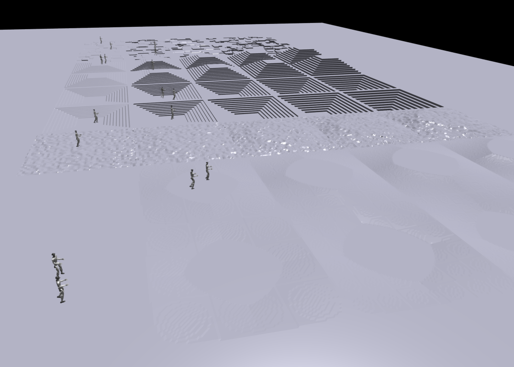

### 7.5 Entrenamiento propuesto desde fase 3

La fase 4 corregida debe continuar desde el modelo útil de fase 3, no desde la fase estancada:

```bash
python legged_gym/scripts/train.py \
  --task=g1 \
  --resume \
  --headless \
  --num_envs=1024 \
  --load_run=May05_21-20-39_fase3 \
  --checkpoint=4000 \
  --run_name=fase4b_coord_terrain \
  --max_iterations=6000
```

Si la GPU no soporta `1024` entornos, se puede bajar a `512`. Lo importante es no evaluar esta fase solo por las primeras iteraciones: al cambiar recompensas y terreno, es normal que las curvas bajen al principio.

Las métricas que interesa mirar son:

- `Train/mean_reward`: debería recuperarse después de la caída inicial.
- `Train/mean_episode_length`: debería mantenerse alto; si baja mucho, el terreno/rewards son demasiado agresivos.
- `Episode/rew_tracking_lin_vel`: debe subir o mantenerse fuerte.
- `Episode/rew_forward_progress`: debe confirmar avance real hacia delante.
- `Episode/rew_alive`: debe estabilizar la política.
- `Episode/rew_feet_too_close`: si empeora mucho, el robot sigue cruzando piernas.
- `Episode/terrain_level`: debe subir poco a poco, no de golpe.

La hipótesis de esta fase es que la política debería conservar la marcha plana aprendida, recuperar avance lineal y empezar a mejorar coordinación sin que el terreno irregular destruya el patrón base. Si vuelve a estancarse, el siguiente ajuste no sería añadir más rewards, sino reducir aún más el terreno (`mesh_type='plane'` durante 1000-2000 iteraciones) y volver a activar `heightfield` cuando `tracking_lin_vel` y `mean_episode_length` estén estables.

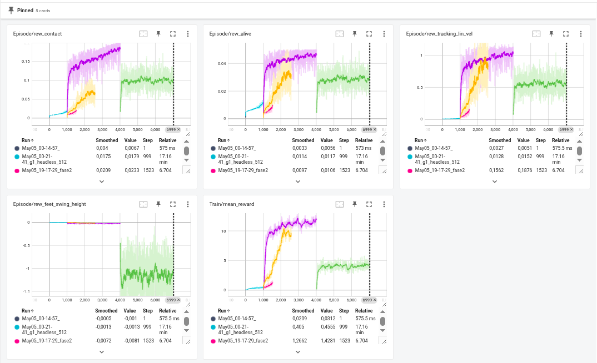

## 8. Actividad 2: bandeja con BeyondMimic

La segunda actividad consiste en estudiar cómo entrenar al G1 para portar una bandeja. En esta parte el enfoque cambia respecto a LeggedGym: ya no se busca solamente que el robot aprenda una marcha estable siguiendo comandos de velocidad, sino que siga una moción de referencia de cuerpo completo.

El profesor indicó usar BeyondMimic, y esto tiene sentido porque BeyondMimic trabaja con whole-body tracking. La tarea de LeggedGym usada en la Actividad 1 controla una versión de G1 centrada en locomoción, con 12 acciones, mientras que una tarea de bandeja requiere normalmente brazos, torso estable y coordinación de cuerpo completo.

### 8.1 Setup

El notebook de referencia para esta parte es:

```text
BeyondMimic/BeyondMimic.ipynb
```

BeyondMimic separa el trabajo en dos bloques:

```text
Training Phase:
  whole_body_tracking/

Deployment Phase:
  motion_tracking_controller/
```

Para empezar la Actividad 2, el primer paso es preparar un entorno limpio para Isaac Lab. Este entorno debe ser distinto al usado en la Actividad 1: LeggedGym usaba Python 3.8 e Isaac Gym, mientras que BeyondMimic usa Isaac Lab, Isaac Sim 4.5 y Python 3.10.

Al preparar este setup apareció un problema práctico: el disco interno del equipo iba justo de espacio. Esto es importante porque Isaac Sim, Isaac Lab, PyTorch CUDA y las extensiones de Omniverse ocupan muchos gigabytes.

El disco interno estaba muy lleno:

```text
/dev/nvme0n1p5  246G  214G   20G  92% /
```

Para suplirlo, se usó un SSD externo montado en `/mnt/linux_ext_500G` con espacio suficiente:

```text
/dev/sda2       492G   96G  371G  21% /mnt/linux_ext_500G
```

Por eso se decidió borrar solo el entorno Conda antiguo de Isaac Lab que estaba en el disco interno:

```bash
conda remove --name isaacLab --all -y
```

Ese entorno estaba en:

```text
/home/hugo/miniconda3/envs/isaacLab
```

Después se creó un entorno nuevo en el SSD externo:

```bash
conda create --prefix /mnt/linux_ext_500G/conda_envs/isaacLab python=3.10 -y
```

Para que Conda pueda encontrar entornos en esa ruta, se añadió el directorio externo a `envs_dirs`:

```bash
conda config --add envs_dirs /mnt/linux_ext_500G/conda_envs
```

Con esto, el entorno puede activarse por nombre:

```bash
conda activate isaacLab
```

O por ruta explícita:

```bash
conda activate /mnt/linux_ext_500G/conda_envs/isaacLab
```

Se comprobó que Python apunta realmente al SSD externo:

```text
/mnt/linux_ext_500G/conda_envs/isaacLab/bin/python
Python 3.10.20
```

También se registró un kernel de Jupyter para poder usar este entorno directamente desde el notebook:

```bash
/mnt/linux_ext_500G/conda_envs/isaacLab/bin/python -m pip install ipykernel
/mnt/linux_ext_500G/conda_envs/isaacLab/bin/python -m ipykernel install --user --name isaacLab-ssd --display-name "isaacLab SSD"
```

El notebook `BeyondMimic/BeyondMimic.ipynb` queda configurado con el kernel:

```text
isaacLab SSD
```

Antes de instalar Isaac Sim o Isaac Lab, conviene comprobar que Python y pip pertenecen realmente al entorno correcto:

```bash
which python
which pip
echo $PYTHONPATH
```

Esto es importante porque ROS puede añadir rutas Python globales en `PYTHONPATH`. Si aparecen rutas de ROS mezcladas con el entorno de Isaac Lab, pueden producirse errores de importación. En ese caso, el notebook recomienda limpiar el entorno antes de instalar:

```bash
unset PYTHONPATH
export PYTHONNOUSERSITE=1
```

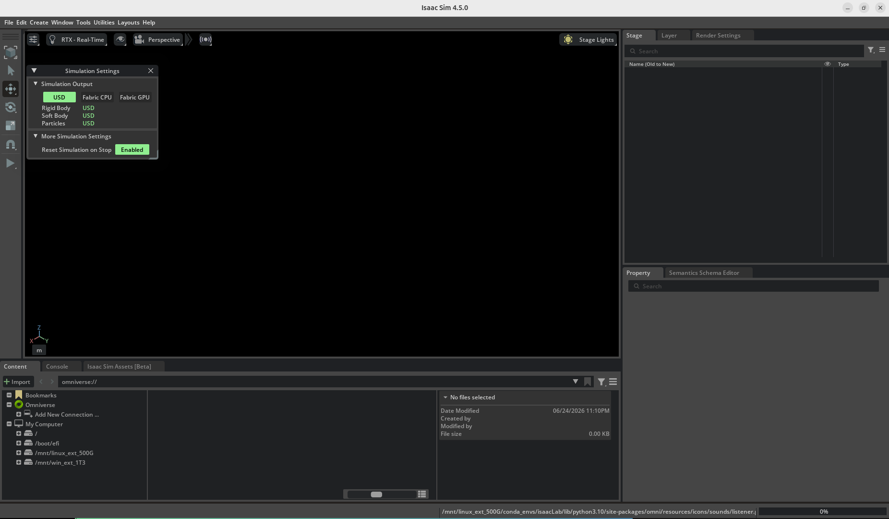

Al lanzar Isaac Sim con interfaz gráfica se observó que el programa consume bastantes recursos (unos 7GB de VRAM) y se queda sin responder durante el primer arranque, porque carga extensiones, recursos gráficos y cachés internas. Para no bloquear el avance de la práctica, de momento se deja el trabajo en modo `headless`, sin abrir la interfaz gráfica, y se reservará la GUI solo para comprobaciones visuales concretas.

La comprobación básica se puede hacer así:

```bash
OMNI_KIT_ACCEPT_EULA=YES isaacsim --headless
```

Pasa lo mismo con Isaac Lab. El log muestra una reserva asociada al renderizado RTX de aproximadamente 7,5 GB (TLAS limit buffer size 7508933632), mientras que la GPU del equipo solo dispone de 4 GB de VRAM (GPU Memory: 4096 MB). Por tanto, la aplicación intenta cargar una escena o configuración de renderizado que requiere más memoria gráfica de la disponible. Esto explica que, aunque Isaac Sim llegue a iniciarse (app ready), el proceso acabe siendo finalizado por el sistema con Terminado (killed).